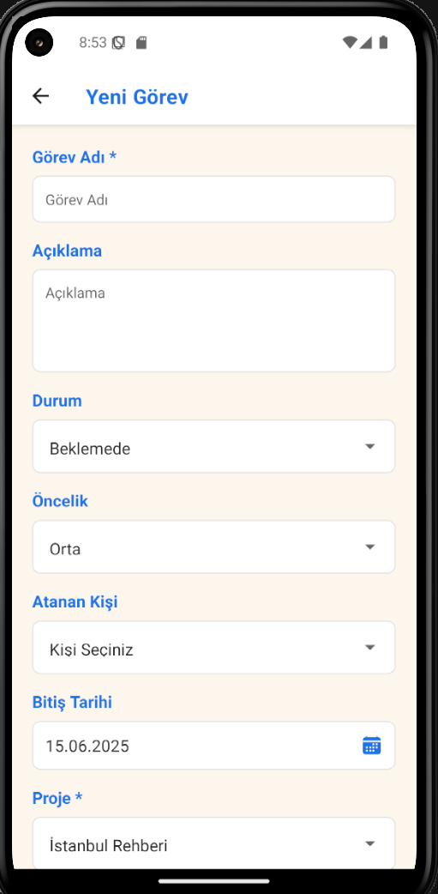
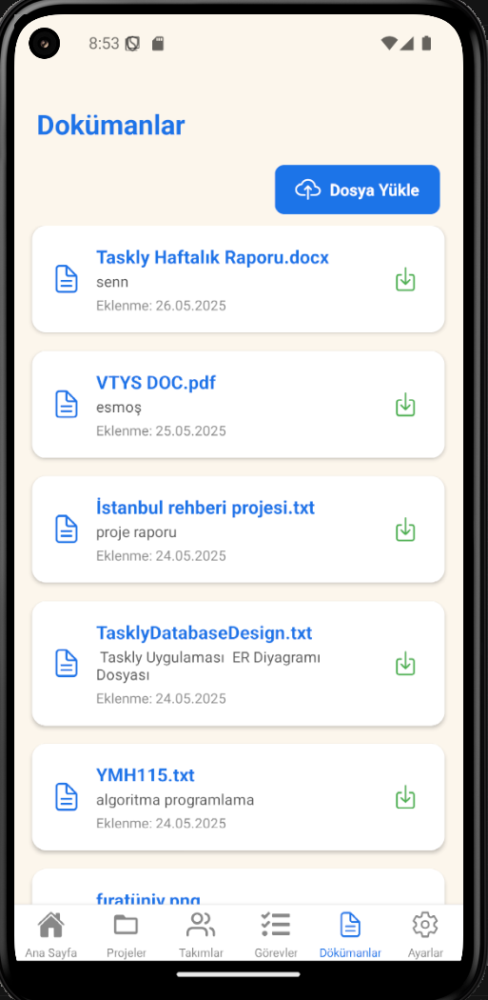
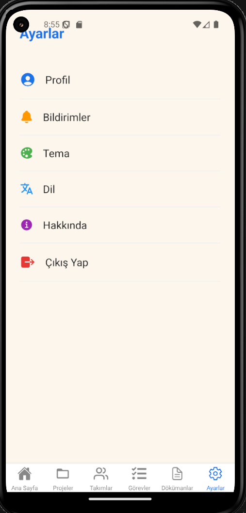
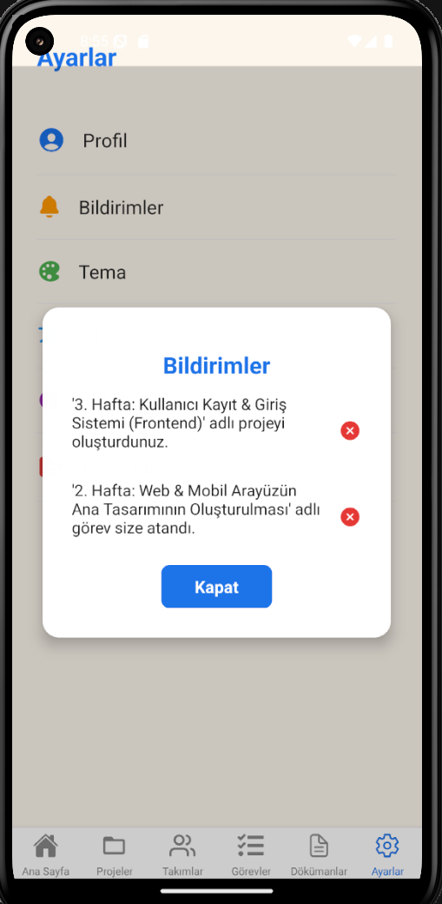

# Taskly – Görev & Proje Yönetimi (Mobil)

**Taskly (Mobil)**, bireysel kullanıcılar ve ekiplerin görev/proje takibini **iOS & Android** üzerinde kolaylaştıran **React Native** tabanlı uygulamadır.  
Bu depo **mobil istemciyi (React Native)** içerir. (Web: React / Backend API: ASP.NET Core)

## 🎯 Amaç
- Proje ve görevlerinizi **her yerden** yönetmek
- Web ve mobil arasında **sorunsuz senkronizasyon** sağlamak
- Basit, hızlı ve dokunmatik odaklı bir deneyim sunmak

## 🚀 Öne Çıkan Özellikler
- **Proje & Görev Yönetimi:** Durum, öncelik, son tarih, atama
- **Atamalar & Ekip:** Görevleri kullanıcılara atama, ekiplerle çalışma
- **Bildirimler:** Uygulama içi / push bildirim tercihleri
- **Doküman/Dosya Ekleme:** Projelere dosya/doküman iliştirme
- **Arama & Filtreler:** Durum/öncelik/etiket ve tarih bazlı filtreler
- **Sade Mobil UI:** Tek elle kullanım, erişilebilirlik, karanlık/aydınlık tema
- **Güvenli Oturum:** JWT tabanlı kimlik doğrulama, güvenli depolama

## 🧭 Ekran Haritası (Mobil)
- **Onboarding / Giriş** (01): Kısa tanıtım ve kimlik doğrulama
- **Ana Ekran / Dashboard** (02): Özet metrikler, hızlı eylemler
- **Projeler** (03–04): Proje listesi & proje oluşturma
- **Görevler** (05–06): Görev listesi & görev oluşturma
- **Takımlar** (07): Ekipler ve yeni takım oluşturma
- **Dokümanlar** (08): Proje dokümanları / ekler
- **Bildirimler** (09): Okunmamış bildirimler ve tercihler
- **Ayarlar** (10): Profil, güvenlik, bildirim tercihleri, dil/tema

## 🛠️ Teknolojiler
- **Mobil (bu repo):** React Native  
- **Navigasyon:** React Navigation  
- **Backend API:** ASP.NET Core (C#), **JWT** kimlik doğrulama  
- **Veritabanı:** PostgreSQL (sunucu tarafı)  
- **Mimari:** RESTful API

---

## 📸 Taskly Mobil – Ekran Görüntüleri

  
  
  

  
  
  

  
  
  

  
  
  

### Dosya Eşlemesi (Hızlı Bakış)
- 01 — `./docs/01-auth-landing-mobile.png`
- 02 — `./docs/02-login-mobile.png`
- 03 — `./docs/03-dashboard-home-mobile.png`
- 04 — `./docs/04-projects-list-mobile.png`
- 05 — `./docs/05-project-create-mobile.png`
- 06 — `./docs/06-teams-list-mobile.png`
- 07 — `./docs/07-team-create-mobile.png`
- 08 — `./docs/08-tasks-list-mobile.png`
- 09 — `./docs/09-task-create-mobile.png`
- 10 — `./docs/10-documents-mobile.png`
- 11 — `./docs/11-setting-mobile.png`
- 12 — `./docs/12-notifications-mobile.png`
